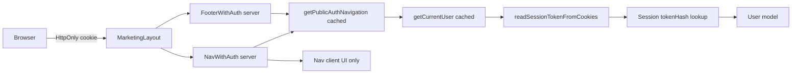

# Authentication — Phase 3

This document covers the authentication architecture, public navigation behavior, admin provisioning, session lifecycle, rate limiting, and manual verification for Phase 3.

## Architecture overview



- Email/password authentication with bcrypt password hashes
- MongoDB-backed sessions referenced by an HttpOnly cookie (`noah_session`)
- Only `tokenHash` is stored in MongoDB; the raw token exists only in the cookie
- Server Actions for register, login, and logout
- Route protection through server layouts (`requireUser`, `requireAdmin`)
- Public navigation is resolved on the server and passed to client components as safe link data only

## Roles

| Role | Created by | Access |
| --- | --- | --- |
| `student` | Public `/register` only | `/dashboard` |
| `admin` | CLI `admin:create` or `admin:promote` only | `/admin` and `/dashboard` |

Public registration always creates `role: "student"`. There is no public admin signup.

## Route behavior

### Guest

| Route | Behavior |
| --- | --- |
| `/login` | Accessible |
| `/register` | Accessible |
| `/dashboard` | Redirects to `/login` |
| `/admin` | Redirects to `/login` |

### Student

| Route | Behavior |
| --- | --- |
| `/login` | Redirects to `/dashboard` |
| `/register` | Redirects to `/dashboard` |
| `/dashboard` | Accessible |
| `/admin` | Redirects to `/dashboard` |

### Admin

| Route | Behavior |
| --- | --- |
| `/login` | Redirects to `/admin` |
| `/register` | Redirects to `/admin` |
| `/admin` | Accessible |
| `/dashboard` | Accessible |

## Public navigation behavior

Single source of truth: [`lib/navigation/auth-nav.ts`](../lib/navigation/auth-nav.ts)

Server wrappers [`NavWithAuth`](../app/components/Nav/NavWithAuth.tsx) and [`FooterWithAuth`](../app/components/Footer/FooterWithAuth.tsx) call [`getPublicAuthNavigation()`](../lib/navigation/get-public-auth-navigation.ts), which reads the current session once per request.

| Auth state | Header/footer auth links |
| --- | --- |
| Guest | **הרשמה** → `/register`, **התחברות** → `/login` |
| Student | **פרופיל** → `/dashboard` |
| Admin | **ניהול** → `/admin` |

Rules:

- Desktop and mobile use the same mapped links from the same server result
- Client `Nav` handles only scroll and mobile menu UI; it does not resolve authentication
- No session token, cookie value, password hash, or MongoDB document is passed to client components
- After login, registration, or logout, `revalidatePath('/', 'layout')` refreshes cached marketing layout output

### Caching

The marketing layout is marked dynamic because it reads request cookies through the server auth flow. This prevents one user's navigation from being served to another user. Public page content structure is unchanged; only the auth links vary per request.

## Session and cookie lifecycle

1. **Login / registration:** create a new session record with fixed expiration, set HttpOnly cookie
2. **Authenticated requests:** read cookie → hash token → lookup session → load active user
3. **Valid reads:** do not extend session expiration (fixed TTL, not sliding)
4. **Expired/orphan/inactive user sessions:** treated as unauthenticated; invalid session rows are cleaned up
5. **Logout:** POST-based server action deletes the session record and clears the cookie

Cookie options:

- `HttpOnly: true`
- `SameSite: Lax`
- `Path: /`
- `Secure: true` in production
- `Max-Age` aligned with the seven-day session TTL

## Rate limiting

Registration:

- IP-based limit through MongoDB `AuthAttempt`
- Always creates `student` only
- Duplicate email and E11000 races return safe field errors

Login:

- Separate IP and normalized-email limits
- Failed attempts record both scopes
- Successful login clears relevant failure counters
- Missing users still run bcrypt against a dummy hash for timing safety
- Invalid credentials return a generic Hebrew error
- Inactive users do not reveal account state

Future hardening (not implemented in Phase 3):

- Redis-backed distributed rate limiting
- CAPTCHA on repeated failures

## Admin provisioning

### Create the first admin

```bash
ADMIN_NAME="Admin Name" ADMIN_EMAIL="admin@example.com" ADMIN_PASSWORD="YourSecurePassword1" npm run admin:create
```

PowerShell:

```powershell
$env:ADMIN_NAME="Admin Name"
$env:ADMIN_EMAIL="admin@example.com"
$env:ADMIN_PASSWORD="YourSecurePassword1"
npm run admin:create
```

Required env vars:

- `ADMIN_NAME`
- `ADMIN_EMAIL`
- `ADMIN_PASSWORD`
- `MONGODB_URI` from `.env.local`

The command never prints passwords, hashes, MongoDB URIs, or session tokens.

| Existing user case | Result |
| --- | --- |
| No user | Creates admin |
| Active student | Stops; use `admin:promote` |
| Active admin | Stops safely; no changes |
| Inactive user | Stops; no changes |
| Duplicate-key race | Stops safely; no silent upsert |

### Promote an existing student

```bash
ADMIN_EMAIL="student@example.com" CONFIRM_ADMIN_PROMOTION=true npm run admin:promote
```

Requires explicit `CONFIRM_ADMIN_PROMOTION=true`. Does not change password or reactivate inactive users.

## SEO and private routes

`noIndex` metadata is set for:

- `/login`
- `/register`
- `/forgot-password`
- `/dashboard`
- `/admin`

Private/auth routes are excluded from [`app/sitemap.ts`](../app/sitemap.ts).

## Manual Phase 3 verification

Run:

```bash
npm test
npm run lint
npm run build
npm run db:test
npm run dev
```

Then verify in the browser:

### Guest

- Homepage and marketing pages show **הרשמה** and **התחברות**
- Mobile menu shows the same two links
- `/dashboard` and `/admin` redirect to `/login`

### Student

- Register a new account
- Public navigation immediately shows **פרופיל**
- Full refresh still shows **פרופיל**
- `/dashboard` works; `/admin` redirects to `/dashboard`
- Mobile menu shows only **פרופיל**

### Admin

- Log in with an admin account
- Public navigation immediately shows **ניהול**
- Full refresh still shows **ניהול**
- `/admin` and `/dashboard` both work
- Mobile menu shows only **ניהול**

### Logout

- Logout from dashboard or admin shell
- Public navigation immediately shows **הרשמה** and **התחברות**
- Refresh preserves guest navigation
- Protected routes redirect to `/login`

## Known future items

- Password reset email delivery
- Email verification
- Higher-scale distributed rate limiting
- Optional CAPTCHA

## Security notes

- Never commit `.env.local` or real credentials
- Never hardcode admin credentials in source code
- No automatic admin seeding during app startup
- Admin creation and promotion are CLI-only operations
